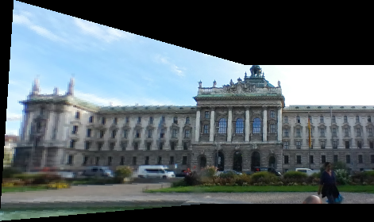

# Image_Stitching
Take two images as input, stitch image1 on top of image2 after applying the correct tranformation

### step-by-step
* Find each images feature points by running them through the SIFT algorithm
* Compare each feature point from image1 with all the feature points of image2, and collect the top 20% or so, with the lowest euclidean distance.
* RANSAC through those feature points to calculate the best homography transformation
* Backward warp to place both images on a new canvas that will correctly fit all of both images to it after the transformation

##

+
 =
=

##

+
 = 
=

